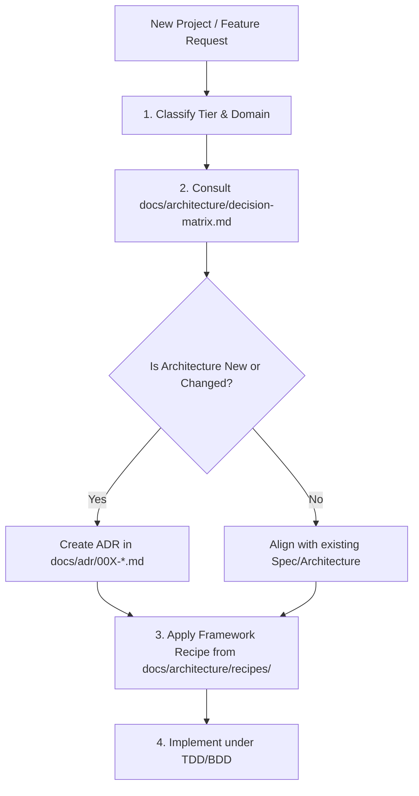

# Architecture Decision & Structural Rules

> **Status:** Mandatory Invariant  
> **Applies to:** All Agents, Workspaces, and Codebases managed by AxonHarness.

---

## 1. Core Mandate

Before generating any application skeleton, new feature folder, or major component, the Agent **MUST** determine and document the architectural archetype and scale tier.

No ad-hoc, unstructured folder dumping ("AI slop") is permitted.

---

## 2. Decision Protocol

1. **Classify the Tier & Domain:**
   - **Domain:** Frontend, Backend, or Fullstack/Monorepo.
   - **Scale Tier:**
     - **Tier 1 (Prototyping / MVP / Script):** Lightweight Modular / Framework Default.
     - **Tier 2 (Standard Application / Growing Feature):** Feature-Driven Design (Frontend) / Modular Monolith (Backend).
     - **Tier 3 (Enterprise / High Domain Complexity / Long Lived):** Feature-Sliced Design (Frontend) / Strict Hexagonal & Ports/Adapters (Backend).
2. **Consult [decision-matrix.md](../../docs/architecture/decision-matrix.md):** Match domain requirements to the appropriate archetype.
3. **Record Architectural Decision (ADR):** If initiating a project or switching paradigms, propose an ADR under `docs/adr/`.
4. **Apply Framework Recipe:** Refer to `docs/architecture/recipes/` for framework-specific idioms (e.g., [react-recipes.md](../../docs/architecture/recipes/react-recipes.md), [angular-recipes.md](../../docs/architecture/recipes/angular-recipes.md), [nestjs-recipes.md](../../docs/architecture/recipes/nestjs-recipes.md), [backend-generic-recipes.md](../../docs/architecture/recipes/backend-generic-recipes.md)).

---

## 3. Structural Invariants

1. **Domain Purity (Tier 2 & 3):**
   - Core domain business logic (entities, pure calculations, domain validations) must never import framework decorators, HTTP request/response objects, or database drivers.
2. **Encapsulation & Public API (Feature/Module boundary):**
   - Every feature or module must expose a single public entry point (`index.ts` / module definition).
   - Internal implementation details of a feature must not be directly imported across feature boundaries.
3. **Direction of Dependencies:**
   - Dependencies must point inward: `UI / Adapters / Framework` $\rightarrow$ `Application / Use Cases` $\rightarrow$ `Domain`.
4. **Colocation over Deep Nesting:**
   - Keep closely related items together (e.g., component, its tests, styles, and dedicated hooks) before creating distant parallel hierarchies.
