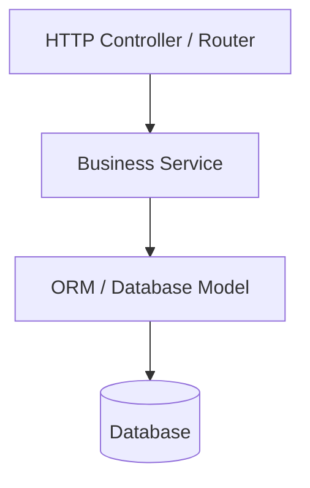
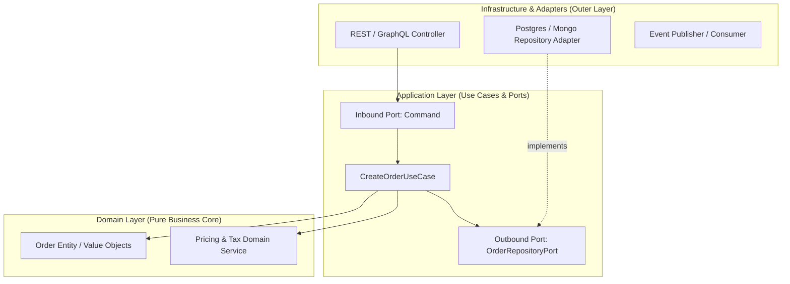

# Backend Architectural Archetypes & Patterns

> **Status:** Official Architectural Guide  
> **Applies to:** NestJS, FastAPI, Go, Spring Boot, Express/Fastify, and backend services.

---

## 1. Core Principles for Backend Architecture

1. **Domain Purity:**
   - The core business rules and calculations must remain independent of external libraries (ORMs, HTTP frameworks, message brokers).
2. **Inversion of Control (IoC) & Dependency Inversion Principle (DIP):**
   - High-level business logic must depend on abstractions (interfaces / ports), not on concrete low-level implementations (adapters / repositories).
3. **Explicit Error Boundaries:**
   - Domain errors (e.g., `EntityNotFoundError`, `InsufficientFundsError`) must be distinct from technical infrastructure errors (e.g., `DatabaseConnectionError`, `HttpTimeoutException`).

---

## 2. Archetypes by Tier

### Tier 1: Layered Architecture (CRUD / Prototypes)



```text
src/
├── controllers/         # HTTP handlers
├── services/            # Business logic and coordination
├── models/ (or entities/)# ORM models (ActiveRecord / DataMapper)
└── utils/
```
* **Best for:** Rapid prototyping, simple CRUD APIs, micro-utilities.

---

### Tier 2: Modular Monolith / Vertical Slices (Standard Backend)

Organized around business capabilities (Bounded Contexts) rather than technical layers:

```text
src/
├── shared/              # Cross-cutting concerns (logging, database connection, middlewares)
└── modules/
    ├── [bounded-context]/  # e.g., auth, billing, orders
    │   ├── dto/            # Request/Response data transfer objects
    │   ├── handlers/       # Controllers, CLI commands, or event listeners
    │   ├── services/       # Module-specific domain and application logic
    │   ├── repository/     # Persistence implementations
    │   └── index.ts        # Module definition & public export
```

* **Best for:** Most growing backend applications, SaaS APIs, modular services.

---

### Tier 3: Hexagonal Architecture (Ports & Adapters) / Clean Architecture (Enterprise)

Enforces strict boundaries between domain, application use cases, and technical infrastructure.



```text
src/
├── core/
│   ├── domain/                  # 100% Pure TypeScript / Language Domain
│   │   ├── entities/            # Business entities & state mutators
│   │   ├── value-objects/       # Immutable value objects
│   │   └── exceptions/          # Domain-specific errors
│   │
│   └── application/             # Use Cases & Port Interfaces
│       ├── use-cases/           # Application logic (e.g. CreateUserUseCase)
│       └── ports/
│           ├── in/              # Inbound ports (Commands/Queries)
│           └── out/             # Outbound ports (Repository, Notification, Payment)
│
└── infrastructure/              # Technical Adapters & External Drivers
    ├── adapters/
    │   ├── persistence/         # TypeORM, Prisma, raw SQL implementations of Out Ports
    │   ├── http/                # Express/Nest/FastAPI controllers implementing In Ports
    │   └── external/            # Stripe, Sendgrid, Kafka implementations
    └── config/                  # Environment, dependency injection wiring
```

* **Best for:** Mission-critical services, long-lived projects, complex domain rules, and high-testability requirements.
