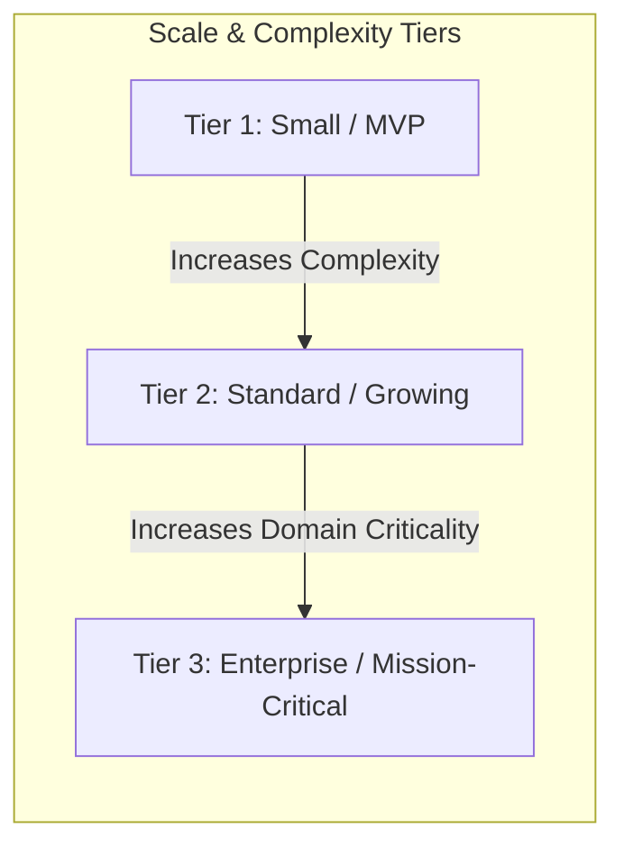
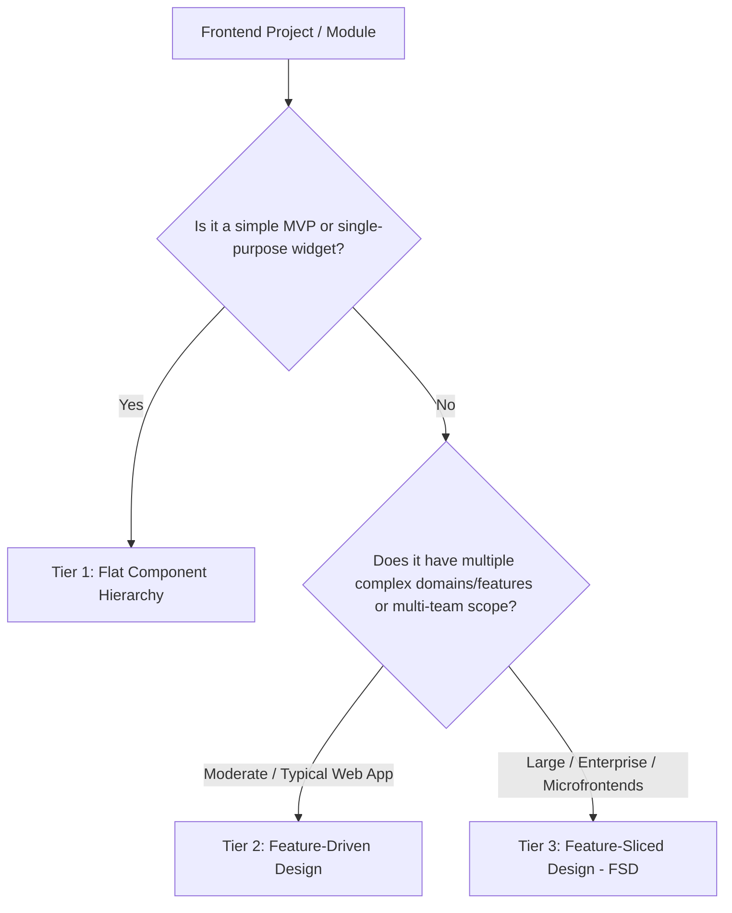
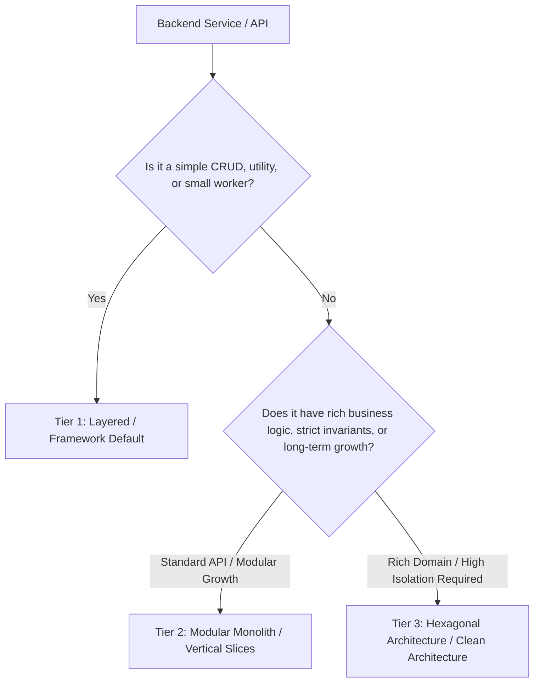

# Architectural Decision Matrix

> **Status:** Official Specification  
> **Source of Authority:** AxonHarness Architecture Protocol

This matrix defines the standard archetypes and complexity tiers to select the optimal architecture for any software project or module.

---

## 1. The 3-Tier Classification Model

| Dimension | **Tier 1 (Prototyping / MVP / Utility)** | **Tier 2 (Standard Application / Growing)** | **Tier 3 (Enterprise / High Complexity)** |
| :--- | :--- | :--- | :--- |
| **Project Lifetime** | Weeks to a few months | 1 – 3+ years | Long-lived / Core enterprise assets |
| **Domain Complexity** | Simple CRUD, scripts, straightforward UI | Multi-feature, moderate business logic | Rich domain model, invariants, high compliance |
| **Team Size** | 1 developer / fast experiments | 2 – 10 developers | Multiple squads / distributed contributors |
| **Architectural Style** | **Lightweight / Flat / Layered** | **Feature-Driven / Vertical Slices** | **Hexagonal / Clean / Feature-Sliced (FSD)** |
| **Coupling Strategy** | Colocated, framework-idiomatic | Encapsulated feature modules | Strict ports & adapters, isolated domain core |

---

## 2. Decision Tree by Application Domain

### A. Frontend Architecture Selection

* **Tier 1:** Flat components (`src/components/`, `src/hooks/`, `src/services/`).
* **Tier 2:** **Feature-Driven Design (FDD)** (`src/features/[feature-name]/` with encapsulated components, hooks, api, and types).
* **Tier 3:** **Feature-Sliced Design (FSD)** / Clean Frontend (`app/`, `pages/`, `widgets/`, `features/`, `entities/`, `shared/`).
* *Reference:* See [frontend-patterns.md](archetypes/frontend-patterns.md) and framework recipes.

---

### B. Backend Architecture Selection

* **Tier 1:** **Layered Architecture** (Controllers $\rightarrow$ Services $\rightarrow$ Repositories/DB).
* **Tier 2:** **Modular Monolith / Vertical Slices** (`modules/[bounded-context]/` with internal handlers and public interfaces).
* **Tier 3:** **Hexagonal Architecture (Ports & Adapters)** (`domain/`, `application/`, `infrastructure/` / `adapters/`).
* *Reference:* See [backend-patterns.md](archetypes/backend-patterns.md) and framework recipes.

---

## 3. Framework Quick-Reference Map

| Technology / Framework | Tier 1 Archetype | Tier 2 Archetype | Tier 3 Archetype |
| :--- | :--- | :--- | :--- |
| **React / Next.js** | Flat `components/` + `pages/` | [Feature-Driven Design](recipes/react-recipes.md) | [FSD (Feature-Sliced Design)](recipes/react-recipes.md) |
| **Angular** | Flat Standalone Components | [Feature Folders + Data-Access](recipes/angular-recipes.md) | [Clean Angular / Enterprise Layered](recipes/angular-recipes.md) |
| **Vue / Nuxt** | Flat SFCs + Composables | Feature Modules + Pinia Stores | FSD Layered + Domain Composables |
| **NestJS** | Default CRUD Modules | [Modular Encapsulation](recipes/nestjs-recipes.md) | [Hexagonal Ports & Adapters](recipes/nestjs-recipes.md) |
| **FastAPI / Python** | Single file / Flat routers | [Feature Packages](recipes/backend-generic-recipes.md) | [Clean Architecture / DDD](recipes/backend-generic-recipes.md) |
| **Go (Gin/Fiber/Chi)** | Flat package / Simple handlers | [Domain-oriented packages](recipes/backend-generic-recipes.md) | [Standard Hexagonal Layout](recipes/backend-generic-recipes.md) |
| **Spring Boot / Java** | Layered `@Service` / `@Repository` | Package-by-feature | Hexagonal Architecture (Ports & Adapters) |
